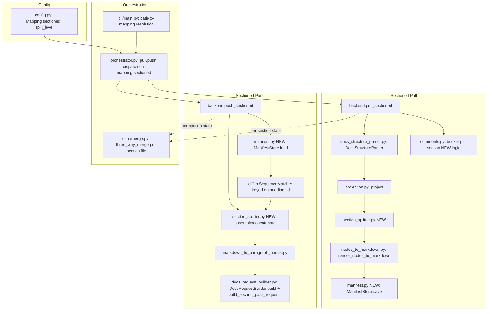

# Implementation Plan: gdocs-sectioned-sync

Source: `project_plans/gdocs-sectioned-sync/requirements.md`, `research/{stack,features,architecture,pitfalls,ux,build-vs-buy}.md`.

## Step 0.5 — Creative Pass: Candidate Architectures

Three candidates considered for where sectioned pull/push logic lives relative to the existing `GoogleDocsBackend`:

**A. Parallel `push_sectioned`/`pull_sectioned` backend methods** — new methods on `GoogleDocsBackend` that do the split/reassemble/manifest work, then call into the existing structural-path internals (`DocsStructureParser`, `project()`, `_build_push_plan`'s tail, `DocsRequestBuilder`) that `push()`/`pull()` already use. `orchestrator.py` branches on `mapping.sectioned` to call one entry point or the other.

**B. Polymorphic `push`/`pull` over `Mapping.sectioned`** — keep single `push()`/`pull()` entry points, branch internally near the top on `mapping.sectioned`, threading directory-vs-file logic through the existing method bodies.

**C. Separate `SectionedSyncEngine` orchestration layer** — a new class above `GoogleDocsBackend` that owns the directory/manifest lifecycle end-to-end and calls the backend's structural primitives (parser, projector, request builder) directly, bypassing `push()`/`pull()` entirely.

| # | Architecture | Pattern lineage | Rejected because |
|---|---|---|---|
| A | Parallel `push_sectioned`/`pull_sectioned` methods, delegating to shared internals | **Strategy** (mapping-level dispatch) + **Template Method** (shared internal steps, e.g. `_build_push_plan`'s diff/request-emission tail, reused verbatim) | *(winner — see below)* |
| B | Single `push`/`pull`, internal branching on `mapping.sectioned` | Conditional/procedural — not really a named pattern, closer to anti-pattern "shotgun conditional" | `push()`/`pull()` are already ~130-380 lines each (`backend.py:172-377`, `852-1228`); interleaving directory-vs-file control flow throughout risks regressing the well-tested single-file path (identity-by-position pitfalls research explicitly warns against retrofitting). Every future single-file bugfix would need to reason about a second mode threaded through the same function. |
| C | Standalone `SectionedSyncEngine` bypassing `push()`/`pull()` | **Layer Supertype**-adjacent orchestration; closer to a **Facade** that reimplements rather than composes | Architecture research (`research/architecture.md`) confirmed the diff/request-emission machinery (`_build_push_plan`, `DocsRequestBuilder.build()`, `build_second_pass_requests`) must run *unchanged* on a single concatenated node list — a separate engine would either duplicate that machinery or need such deep backend access that it stops being a real boundary. Also fragments where "how does docspan talk to Google Docs" lives, hurting discoverability for the next maintainer. |

**Winner: A.** `push_sectioned(directory, doc_id, ...)` / `pull_sectioned(directory, doc_id, ...)` are added as new methods on `GoogleDocsBackend`, next to `push`/`pull`. They own manifest I/O, splitting/concatenation, and comment bucketing, then hand a flat node list (pull output) or flat markdown string (push input) to the *same* internal helpers `push()`/`pull()` already call — concretely, pull always takes the structural path (`DocsStructureParser` + `project()` + `render_nodes_to_markdown()`, `backend.py:874-908`) and push's assembled markdown feeds `_build_push_plan`'s diff → `DocsRequestBuilder().build()` → `build_second_pass_requests` tail unchanged. Verified against the actual signature (`backend.py:172-299`), `_build_push_plan(local_path: str, doc_id, tab_id=None)` reads its own content from `local_path` (`pathlib.Path(local_path).read_text()`) and resolves every embedded image against that one path (`resolve_document_images(image_nodes, local_path, ...)`, `image_source.py:218-260`) — it has no parameter for pre-assembled content from N files, so the *front half* (read content, resolve images) is not reusable as-is for sectioned push; only the diff/request-emission tail is. Task 3.1.3 below refactors that front half. This is a **Strategy** at the `orchestrator.py` call-site level (mapping picks a sync strategy) composed with **Template Method** reuse of the existing algorithm skeleton for diff/request emission — new code is confined to the *split*/*assemble* steps plus the narrow front-half refactor, which is exactly where the research says the actual novelty is. `Mapping.sectioned: bool` (config.py:78) is the discriminant `orchestrator.py` and `cli/main.py` branch on to choose A's entry points vs. the legacy ones; existing mappings have `sectioned` unset/`False` and are byte-for-byte untouched.

## Domain Glossary

| Term | Definition | Source |
|---|---|---|
| Section | A contiguous run of `DocsParagraphNode`s from one split-level heading (inclusive) up to the next split-level heading (exclusive), or the pre-first-heading run ("preamble"). | `research/architecture.md`, `docs_structure_parser.py:133-260` |
| Manifest | `_manifest.yaml` sidecar per sectioned directory: ordered list of `{heading_id, slug, filename}` records that is the authoritative order and identity map for a sectioned mapping. | `research/stack.md`, `research/ux.md` |
| split_level | Configured heading style (e.g. `HEADING_1`) at which a document is partitioned into sections; sectioned pull walks the flat node list once and starts a new section at each paragraph whose `style` matches this level. | requirements.md Q1, `research/architecture.md` |
| heading_id | Google Docs' own persistent per-heading-paragraph identifier (`DocsParagraphNode.heading_id`, `docs_structure_parser.py:188`), used as the manifest's stable section-identity key. Does NOT survive delete+reinsert. | requirements.md Q1, `research/pitfalls.md` |
| Orphan section | A section file present on disk (or a manifest entry) whose counterpart was deleted on the other side since last sync — surfaced as `conflict`, never silently dropped. | requirements.md success metrics, `research/ux.md` |
| Residue | The existing docspan idiom (`projection.py`'s `Residue`) for content/ambiguity that a projection or split step can't cleanly represent and must surface as a warning instead of silently dropping. | `research/pitfalls.md`, `projection.py` |
| Sectioned mapping | A `markgate.yaml` `Mapping` entry with `sectioned: true`, whose `local` field names a directory (not a file) containing `NN-slug.md` section files plus `_manifest.yaml`. | requirements.md Scope |
| Fixpoint | The existing pull→push-with-no-edits round-trip guarantee (no diff on the Google Doc) extended across the split: split/rejoin must be exact inverses at the node-list level. | requirements.md Success Metrics, `research/architecture.md` |
| Preamble / section 0 | Content before the first split-level heading; still needs a section file+manifest entry since it's real doc content with no heading of its own. | `research/features.md` edge case 5 |
| Section file | One `NN-slug.md` file — must be self-sufficient in isolation (own heading, own body) per the agent-accessibility requirement. | `research/ux.md` |
| Comment bucketing | Assigning a Drive comment (`quotedFileContent.value`) to the section file whose rendered text contains the quoted text; unmatched comments become residue. | requirements.md Q2, `research/architecture.md` |
| In-place move (reorder) | Reordering sections via Docs API requests that relocate existing content ranges without deleting and reinserting them, so `heading_id`s (and therefore cross-section anchors) survive. | `research/pitfalls.md` |

## Pattern Decisions

| Concern | Pattern | Justification |
|---|---|---|
| Manifest read/write | **Repository** (a small `ManifestStore` with `load`/`save`) + atomic write via temp-file-then-`os.replace`, mirroring `config.py:126-167`'s `save_config` | Isolates manifest I/O from split/assemble logic; atomic swap prevents the partial-write desync `research/pitfalls.md` calls out as the classic costly-to-retrofit bug. |
| Section splitting | **Iterator/Visitor** over the flat `List[DocsParagraphNode]` — a single forward pass grouping on `style == split_level`, invoked *after* `project()` (per architecture research's invariant #2) | Matches the existing flat-list traversal style already used in `nodes_to_markdown.py`'s `_dispatch_key`; no new tree structure needed since nodes are already flat. |
| Section reassembly | **Template Method** — reuse `_build_push_plan`'s diff→emit tail unchanged; the parse/image-resolution front half is refactored (Task 3.1.3) to accept pre-assembled content instead of re-reading a single `local_path`, then a concatenation pre-pass (`List[section_markdown] -> one target_nodes list`) feeds it | Directly implements the de-risking finding in `research/features.md`/`architecture.md`: no second diff engine, no new request-emission code path — the refactor is confined to how content/images reach that pipeline, not the pipeline itself. |
| Add/delete/reorder detection | **Strategy**-selected `difflib.SequenceMatcher` keyed on `heading_id` (same mechanism `docs_request_builder.py` already uses 3x, and the Confluence ADF comparator) | `research/build-vs-buy.md` explicitly recommends reusing this over hand-rolled LCS or a new dependency; keying on `heading_id` instead of position/content is what makes reorder detection survive renames. |
| Comment bucketing | **Chain of Responsibility**-flavored fallback: try exact `quotedFileContent` substring match against each section's rendered text in manifest order → first match wins → no match falls through to "unassigned" residue | Matches `DocsRequestBuilder._align_for_styling`'s existing content-based (not index-based) matching philosophy; explicit fallback avoids inventing a second silent-drop mechanism. |
| CLI path-to-mapping resolution | **Specification pattern** (small predicate: "does this path fall under mapping X's directory") replacing today's exact `m.local == file` equality check at `cli/main.py:466,578,789` | Today's resolution is a flat equality; sectioned mappings need "is this path `mapping.local` itself, or a file inside it" — a small predicate object/function keeps both cases behind one lookup call so CLI commands don't each hand-roll directory-membership logic. |

## Migration Plan

- New optional `Mapping.sectioned: bool = False` and `Mapping.split_level: Optional[str] = None` fields on `config.py:78`'s `Mapping` model, following the `tab_id` precedent (`Optional[...]`, default `None`/`False`). `load_config`/`save_config` need no structural change — pydantic defaults absent fields, and `_merge_into`'s round-trip YAML preserves unknown-to-old-version keys.
- Existing mappings: `sectioned` absent → `False` → `orchestrator.py` and `cli/main.py` route through the existing `push()`/`pull()` methods, completely unchanged code path. No behavior change, no migration required, verified by: existing test suite must pass unmodified after this change lands.
- Opt-in: user adds `sectioned: true` and `split_level: HEADING_1` (or `HEADING_2`, etc.) to a mapping entry, and changes `local` to point at a directory instead of a file. First `docspan pull` on that mapping creates the directory, `NN-slug.md` files, and `_manifest.yaml` from scratch (this is the "first-sync" case already modeled by `PullOutcome(action="first-sync")` in `orchestrator.py`).
- No auto-migration of existing single-file mappings into sectioned mode (explicitly out of scope per requirements.md).

## Observability Plan

Extends the existing closed `PullResult`/`PushResult` status enum (`ok|conflict|error|skipped|warning`, push also `blocked`) rather than inventing a parallel vocabulary, per `research/ux.md`. Message shapes below should be implemented against `research/ux.md`'s concrete message templates directly (not re-derived at implementation time) to avoid drift:

| Situation | Status | Message shape |
|---|---|---|
| Section renamed, `heading_id` unchanged (heading text changed) | `ok` | States explicitly that a content-driven rename was detected and which slug changed, so it doesn't read as silent. |
| Section renamed purely due to renumbering (Task 2.2.2 — insert/delete elsewhere shifted its `NN` prefix) | `ok` | Named and grouped separately from content-driven renames above, so a user isn't misled into thinking the section's heading or content changed when only its ordinal prefix did. |
| Two sections reference identically-named-but-different images at push time (Task 3.1.3) | `warning` | Names both originating sections and the shared filename, so the ambiguity is surfaced rather than one image silently winning. |
| Section deleted on one side only | `conflict` | Names which side (local/remote) is missing the section and its last-known heading text/filename; distinguishes "ambiguous, needs a decision" from "unambiguous delete, already applied." |
| Push conflict spanning multiple sections | `conflict` | Per-section table (section, file, conflict kind), not one opaque mapping-level failure line. |
| `split_level` heading depth doesn't exist in the doc | `error` (pull time) | States the deepest heading style actually found, so the user isn't sent doc-diving. |
| Comment unmatched by bucketing | `warning` (residue) | Names the comment id/snippet and that it's unassigned, consistent with existing residue-warning surfacing (`projection.py`, `image_source.py`). |
| `DiffTooExpensive` guard trips on reassembled push | `blocked` | States the guard tripped, points at "the doc got too large to diff safely" as concrete next action, matching push's existing `blocked` semantics (no fallback, per pitfalls research — PR #50/#67 reverted a fallback). |
| Reorder invalidates a cross-section anchor (either go/no-go branch of Task 3.2.2) | `warning` | Names the stale anchor (source section, target section, anchor text) so a user knows a "See ... (section 05)"-style reference may now point at the wrong or nonexistent heading — surfaced regardless of whether the go/no-go gate resolved "go" or "no-go"; not assumed-covered by the generic reorder-detection row. |

## Scope Cut List (if the Large/3–6-week appetite runs over)

Per requirements.md's Appetite constraint ("scope must fit the appetite... do not move the deadline"), if the team runs over, cut in this order before extending the timeline:
1. **Epic 4 (comment sidecar bucketing)** — ship sectioned pull/push first with a single doc-level comment sidecar (today's existing behavior), and land per-section comment bucketing as a fast-follow. Comment sidecars are explicitly the scope area requirements.md's Rabbit Holes flagged as most likely to "balloon scope if not bounded early."
2. **Task 3.2.2/3.2.3 in-place-move optimization** — if the design spike times out or the fallback proves complex, ship reorder support with the accept-`heading_id`-churn fallback (ADR-002's documented worst case) rather than spending further budget chasing a move primitive.
3. **Epic 7 Story 7.5 (`sectioned` + `tab_id` matrix)** — if genuinely squeezed, ship with `sectioned` and `tab_id` mutually exclusive (reject the config combination at validation time, per Task 1.1.2's validator) rather than fully supporting their interaction, and revisit as a fast-follow.

**Adoption assumption**: this project's success metrics (requirements.md) are functional/correctness criteria (fixpoint, section-level diff detection), not adoption metrics, because docspan has no telemetry today (per Constraints: "no new observability stack"). The motivating case is one incident (the "Deployment Safety on Kubernetes" doc); actual uptake across other large markgate.yaml mappings is an open assumption, not validated by usage data. If sectioned mode sees no opt-in beyond the motivating mapping within a month of shipping, that is a signal to deprioritize further sectioned-mode investment (e.g. Epic 4 fast-follow, partial-section pull/push per Unresolved Question 1) rather than a plan defect.

## Risk Control

- **Feature flag equivalent**: opt-in `sectioned: true` field per mapping (Mapping.sectioned, config.py:78). Default `False`/absent for every mapping today.
- **Rollback**: remove the `sectioned: true` field (and revert `local` to a file path) from `markgate.yaml`. Since sectioned mode's manifest/section files are plain YAML/markdown on disk, a user can also manually reassemble by concatenating section files in manifest order back into one `.md` file, then delete the directory — this is a manual, documented fallback, not automated in v1.
- Independent of any application-level flag, the code path split itself (new `push_sectioned`/`pull_sectioned` methods, called only when `mapping.sectioned`) means a bug in sectioned logic cannot execute against a non-sectioned mapping — this is the primary blast-radius control, stronger than a runtime toggle.

## Unresolved Questions

1. **Partial single-section pull/push** (fetch/push exactly one section file without touching siblings) is not committed to v1 scope. `research/features.md` flags it as a likely unstated need. Recommendation: land whole-directory pull/push first (matches requirements.md's explicit Scope), revisit partial pull as a fast-follow once the manifest/identity model is proven — but call this out to the user before Phase 4 lands so it isn't assumed included.
2. **Exact orphan-section-on-delete default**: research resolves that it must be `conflict`, never silent — but whether the *default* resolution offered (e.g. `docspan conflicts resolve`) should default to "keep both" vs "prompt only" is not settled. Plan defaults to prompt-only (safest), matching existing conflict-resolution UX; revisit if this proves too high-friction.
3. **Edit-vs-rename-in-same-cycle undecidability** (a heading renamed AND heavily edited in one cycle) is accepted as a named limitation per pitfalls research, not solved — needs a one-line doc note so users don't file it as a bug.
4. **`DiffTooExpensive` thresholds** are tuned against small single-file fixtures and explicitly NOT validated against a large reassembled multi-section target. Epic 7 includes a task to build a large fixture and check it against the *existing* thresholds first (see Task 7.4.1 below) — the actual pass/fail outcome, and whether any retuning is needed at all, is unresolved until that task runs.
5. **Reorder-as-in-place-move implementation detail**: the pitfalls research mandates in-place move over delete+reinsert to preserve `heading_id`s, but the exact `docs_request_builder.py` request shape (e.g. `UpdateTextStyleRequest`-adjacent range-move primitives Google's batchUpdate API actually exposes) needs a design spike in Epic 3 before implementation — flagged as the highest-uncertainty task in the whole plan (see ADR-002).
6. **Cross-section link rendering** ("See ... (section 05)") — the concrete markdown syntax for a resolved cross-section reference is not yet chosen; Epic 2/3 tasks should reuse `heading_anchors.py` resolution but the human-readable rendering format is an open design detail.

## Dependency Visualization



ASCII fallback (pull path):

```
Mapping.sectioned=true
        |
        v
backend.pull_sectioned(dir, doc_id)
        |
        v
DocsStructureParser.parse()  -> flat nodes (ALWAYS structural path)
        |
        v
projection.project()          -> markdown-representable nodes
        |
        v
section_splitter.split(nodes, split_level)  -> [ (heading_id, nodes...), ... ]
        |                                              |
        v                                              v
render_nodes_to_markdown()  per section        comments.py bucket by quotedFileContent
        |                                              |
        v                                              v
   NN-slug.md files  <-----------------------  {file}.comments.md per section
        |
        v
manifest.py: ManifestStore.save(_manifest.yaml, atomic tmp+rename)
```

## Phase / Epic / Story / Task Breakdown

### Epic 1 — Config schema + manifest module

**Story 1.1**: As a docspan maintainer, I can add `sectioned: true` and `split_level` to a mapping without breaking existing mappings.
- Given a `markgate.yaml` with only pre-existing mapping fields, When `load_config` runs, Then it parses successfully with `sectioned=False`, `split_level=None`.
- Given a mapping with `sectioned: true, split_level: HEADING_1`, When `load_config` runs, Then `Mapping.sectioned is True` and `Mapping.split_level == "HEADING_1"`.
- Given a mapping with `sectioned: true` and `split_level` absent/`None`, When `load_config` runs, Then it raises a clear validation error at load time (not a runtime `AttributeError`/`KeyError` deep inside `pull_sectioned`/`section_splitter.split_nodes`).
- Given a mapping with `sectioned: false` (or absent) and `split_level` set to a non-null value, When `load_config` runs, Then it raises a clear validation error — `split_level` without `sectioned: true` is rejected, not silently ignored, since a silently-ignored field is indistinguishable from a typo (e.g. `sectioned` misspelled) to the user.
- Task 1.1.1: Add `sectioned: bool = False` and `split_level: Optional[str] = None` to `Mapping` (config.py:78).
- Task 1.1.2: Validate `split_level` is one of `HEADING_1`..`HEADING_6` at load time; reject/raise a clear error otherwise (feeds the "misconfigured split_level" UX shape). Additionally, add a pydantic `@model_validator(mode="after")` on `Mapping` (config.py has no existing `@model_validator`/`@field_validator` precedent to follow — `Mapping` today is a plain field-only `BaseModel`, so this introduces the pattern) enforcing `sectioned == (split_level is not None)`: `sectioned=True` with `split_level=None` raises `ValueError("sectioned mappings require split_level")`; `sectioned=False` with `split_level` set raises `ValueError("split_level requires sectioned: true")` rather than being silently accepted-and-ignored. This makes the combination fail at `load_config` time with a pydantic `ValidationError` naming the offending mapping, instead of surfacing confusingly at pull/push time.

**Story 1.2**: As the sectioned pull/push code, I can atomically read/write a `_manifest.yaml` keyed by `heading_id`.
- Given a manifest with N ordered `{heading_id, slug, filename}` entries, When `ManifestStore.load(path)` runs, Then it returns the entries in file order with no re-sorting.
- Given a manifest write interrupted mid-write (simulated crash), When the directory is inspected afterward, Then either the old manifest or the new manifest is present in full — never a partial/corrupt file.
- Task 1.2.1: New `src/docspan/backends/google_docs/manifest.py` — `SectionManifestEntry` dataclass (`heading_id`, `slug`, `filename`, plus optional freeform `title` for display), `ManifestStore.load`/`save`. Uses plain `yaml` (`PyYAML`, matching the `onboarding.py:11` precedent), not `ruamel.yaml` — the manifest is machine-authoritative with no user hand-edited comments to preserve, unlike `config.py`'s round-trip-preserving `markgate.yaml` use of `ruamel.yaml`.
- Task 1.2.2: `save` uses temp-file-in-same-dir + `os.replace`, mirroring `config.py:126-167`.
- Task 1.2.3: `_manifest.yaml` filename constant + doc comment stating explicitly it is not `.md` so `*.md` globs never pick it up.

### Epic 2 — Sectioned pull (split)

**Story 2.1**: As a user with a sectioned mapping, pulling produces one `NN-slug.md` file per split-level heading section, in document order.
- Given a Google Doc with 5 `HEADING_1` sections plus preamble content, When `docspan pull` runs on a `sectioned: true, split_level: HEADING_1` mapping pointed at an empty directory, Then the directory contains `00-preamble.md` (or equivalent front-matter file) through `05-<slug>.md`, plus `_manifest.yaml` with 6 entries in order.
- Given a section file read in isolation, When an agent opens only that file, Then it contains its own heading and full body text with no dependency on sibling files to be meaningful.
- Task 2.1.1: New `src/docspan/backends/google_docs/section_splitter.py`: `split_nodes(nodes: List[DocsParagraphNode], split_level: str) -> List[Section]` — single forward pass, groups after `project()` has already run (architecture invariant #2).
- Task 2.1.2: Preamble/"section 0" handling: content before first split-level heading becomes its own `Section` with no `heading_id`; give it a synthetic manifest identity using the fixed sentinel key `"__preamble__"` (chosen because it can never collide with a real Google Docs `heading_id`, which is always API-assigned and never developer-chosen) that is stable across pulls. Per architecture-review's illegal-state concern, this sentinel is a `heading_id`-typed field holding a non-Docs value by convention; `SectionManifestEntry` documents this explicitly in a docstring so a future reader doesn't mistake `"__preamble__"` for a real Docs ID.
- Task 2.1.3: `backend.pull_sectioned()`: always uses the structural path (`DocsStructureParser` + `project()`), never Drive HTML export — per architecture research finding that HTML export can't be scoped to a heading range.
- Task 2.1.4: Per-section `render_nodes_to_markdown()` call (confirmed side-effect-free/local-scoped, safe per-section per architecture research) → write via temp-dir-then-rename (ties into Epic 6).
- Task 2.1.5: Filename generation: `NN-slug.md`, zero-padded to width of section count, slug from `heading_anchors.slugify()` — reuse, no new slug implementation.

**Story 2.2**: As a user, re-pulling after only a heading rename doesn't renumber unrelated files.
- Given an existing sectioned pull where section 3's heading text changes but its position doesn't, When `docspan pull` runs again, Then section 3's `heading_id` is matched and **its file is renamed to the new slug** (`03-<old-slug>.md` → `03-<new-slug>.md`, manifest `slug`/`filename` updated) — this is the committed behavior, not left ambiguous as "renamed (or content changed)". Sections 1,2,4,5's filenames and `heading_id`s are untouched.
- Task 2.2.1: Splitter must match sections to existing manifest entries by `heading_id` first, falling back to positional-only for genuinely new sections (no existing `heading_id` match). On a `heading_id` match with changed heading text, re-slugify and rename the file (git-mv semantics: content preserved, path changes) rather than treating it as a content-only edit. Any rename (content-driven here, or renumbering-driven per Task 2.2.2) must also rekey that section's per-file state entry (Task 5.2.1, keyed by `local_path`) to the new path in the same operation — never leave the old path's entry orphaned, since an orphaned entry would either surface a spurious conflict (stale entry treated as a deleted file) or silently lose the merge base for the renamed file on next push.
- Task 2.2.2: **Insert/delete-in-the-middle renumbering.** Because filenames carry a zero-padded ordinal prefix (`NN-slug.md`), inserting or deleting a section shifts every subsequent section's `NN` prefix even though their `heading_id`s and content are unchanged (research/ux.md flags this as the sharpest surprise risk in the feature). Given a 5-section directory with a new section inserted at position 3, When `docspan pull` runs again, Then sections originally at positions 3–5 are renamed to 4–6 (content and `heading_id` untouched, matched by `heading_id` not position) and the pull result reports which files were renamed purely due to renumbering (distinct from a content-driven rename) so a user isn't surprised by a large diff of untouched files.

### Epic 3 — Sectioned push (reassembly + add/delete/reorder detection)

**Story 3.1**: As a user, pushing a sectioned directory reassembles it into the Google Doc, preserving section order from the manifest.
- Given N section files and a manifest declaring their order, When `docspan push` runs, Then the resulting Google Doc's heading order matches manifest order, not filesystem `ls` order or file-content order.
- Task 3.1.1: `backend.push_sectioned()`: read manifest, read each section file, concatenate markdown strings in manifest order into one string.
- Task 3.1.2: Feed concatenated markdown into `MarkdownToParagraphParser().parse()` → `target_nodes`, then into `_build_push_plan`'s diff/request pipeline (`DocsRequestBuilder().build()`, `build_second_pass_requests`) via the Task 3.1.3 refactor — no new diff engine (Template Method reuse); only the front half (content acquisition, image resolution) changes.
- Task 3.1.3: **Refactor `_build_push_plan`'s front half** (`backend.py:172-231`) so it no longer hard-requires reading `local_path` itself. Add an optional `content: Optional[str] = None` parameter: when given, skip `pathlib.Path(local_path).read_text()` and parse `content` instead (single-file `push()`/`preview_push()` keep calling it with `content=None`, fully unchanged). For image resolution, `resolve_document_images(image_nodes, local_path, ...)` (`image_source.py:218-260`) only ever uses `markdown_path` to compute `Path(markdown_path).resolve().parent` inside `build_source` (`image_source.py:91-109`) — **`build_source` takes `.parent` of whatever it's given, so passing the bare sectioned directory resolves images one level too high; `push_sectioned` must pass one section file's own path (e.g. the manifest's first/anchor section file) as `markdown_path`, never the directory itself.** `push_sectioned` therefore calls `_build_push_plan(local_path=<first section file's path>, doc_id, content=<concatenated markdown>, tab_id=...)`. This is a single shared anchor for all N sections' images, which is correct as long as every section file lives in the same flat directory (true for v1 per the Migration Plan); if section subdirectories are ever allowed (out of scope for v1), this single-anchor assumption breaks and `resolve_document_images` would need a per-node path list at that point — noted so the simplification isn't silently outgrown. Story 7.1/7.2 fixtures should include two sections with identically-named-but-different images (e.g. two `./diagram.png`s) to prove this single-anchor resolution surfaces an explicit `warning`/`error` on collision rather than silently picking one (pre-mortem #5, P3 — accepted as a known limitation to detect, not solve, in v1).

**Story 3.2**: As a user, add/delete/reorder of sections is detected and reported distinctly from line-level diffs within one file.
- Given a section removed from the local directory (file + manifest entry both gone) with no corresponding remote change, When `docspan push` runs, Then the push plan includes deletion of that section's content range in the remote doc, reported as a section-level delete, not merged into an adjacent section's diff.
- Given two sections in the local directory whose order was swapped versus the manifest, When `docspan push` runs, Then the reorder is detected via `heading_id` identity (not position) and results in an in-place move rather than delete+reinsert, preserving both sections' `heading_id`s.
- Task 3.2.1: `SequenceMatcher` over `heading_id` sequences (stored-manifest-order vs current-local-directory-order) to classify each section as unchanged/inserted/deleted/moved, reusing the pattern already used 3x in `docs_request_builder.py`.
- Task 3.2.2: **Design spike** (flagged high-uncertainty, see Unresolved Question 5 / ADR-002): determine the concrete Docs API batchUpdate request shape for an in-place move of a content range, versus what `docs_request_builder.py` currently supports (it currently only expresses insert/delete/style-update, not "move"). Output: either a real move primitive, or a documented decision to implement "move" as copy-content-to-new-position + delete-old-range-only-after-successful-insert (still avoiding a naive delete-then-reinsert-from-markdown that regenerates `heading_id`). Timeboxed; the spike must produce one of the two outcomes below before Task 3.2.3 starts.

**Go/no-go gate (after Task 3.2.2, before Task 3.2.3 / Story 7.3)**: This is the highest-uncertainty task in the plan (Unresolved Question 5), so downstream tasks must not assume success.
  - **Go** — a real move-equivalent primitive (or the copy-then-delete-after-insert fallback, per ADR-002) is found within the timebox: proceed to Task 3.2.3 implementing that shape.
  - **No-go** — no viable primitive is found within the timebox: this is an acceptable spike outcome, not a plan failure. Fall back to ADR-002's already-documented alternative — copy-content-to-new-position, delete-old-range only after the insert succeeds — as the *default* implementation for Task 3.2.3, rather than blocking Epic 3. If even that fallback proves infeasible, ADR-002's Consequences section names the further fallback: accept `heading_id` churn on reorder as a documented known limitation, with cross-section anchors re-resolved post-push.
  - Either way, Task 3.2.3 and Story 7.3's acceptance criteria (below) must hold: they describe outcome-shape ("reorder preserves identity" / "reorder is detected and reported"), not a specific request primitive, so neither needs rewriting once the gate resolves — only Task 3.2.3's implementation detail depends on which branch was taken.
- Task 3.2.3: Apply the existing write-backwards, highest-anchor-first request ordering (`docs_request_builder.py:1133-1195`) to whatever move/reassembly requests the go/no-go gate above selects (real move primitive, copy+delete-after-insert fallback, or accept-heading_id-churn) — do not assume it "just scales," per pitfalls research.

**Story 3.3**: As a user, a push that would require an unsafely large diff is refused with a clear reason, not attempted.
- Given a reassembled `target_nodes` list large enough to trip `DiffTooExpensive` (`docs_request_builder.py:53-113`), When `docspan push` runs, Then the result status is `blocked` with a message stating the diff was too large to compute safely, and no partial batchUpdate is sent.
- Task 3.3.1: Re-validate `DiffTooExpensive` thresholds against a realistic large multi-section fixture (ties to Epic 7). **`_MAX_COMPARISON_CELLS`/`_MAX_DUPLICATE_RUN` (`docs_request_builder.py:43-45`) are module-level globals shared by every `_bounded_opcodes` call site — there is no such thing as "the sectioned threshold" separate from "the single-file threshold."** Prefer the fixture proving a realistic concatenated multi-section doc never approaches the current single-file-tuned ceiling (no retuning needed). Only if the fixture legitimately trips the guard, and only after Task 7.4.1's regression test is in place, may the shared global values be loosened — never add a fallback path (PR #50/#67 precedent: reverted after regression), and never introduce a context-scoped override as a substitute for verifying the existing ceiling still holds for single-file pushes.

### Epic 4 — Per-section comment sidecars

**Story 4.1**: As a user, each section file has its own `{file}.comments.md` sidecar containing only comments about that section.
- Given a Google Doc with comments quoting text found in section 3 only, When `docspan pull` runs, Then `03-slug.comments.md` contains those comments and no other section's sidecar does.
- Given a comment whose `quotedFileContent` text doesn't match any section's rendered text, When `docspan pull` runs, Then it's surfaced as a `warning`/residue naming the comment, not silently dropped and not silently attached to the wrong section.
- Task 4.1.1: Bucketing function: for each comment, substring-match `quotedFileContent.value` against each section's rendered markdown text in manifest order, first match wins (Chain of Responsibility per Pattern Decisions). If the quoted text matches more than one section, this is an ambiguous match, not a silent first-wins pick: still assign to the first (manifest-order) match for determinism, but surface a `warning` naming the comment id/snippet and every matching section, per the Observability Plan's "Comment unmatched by bucketing" row pattern.
- Task 4.1.2: Reuse `format_comments_markdown`/`parse_reply_directives` (`comments.py`) unchanged, invoked once per section with its pre-filtered comment list.
- Task 4.1.3: Unassigned-comment residue reporting, consistent with existing residue idiom.

### Epic 5 — CLI integration + state/merge extension

**Story 5.1**: As a CLI user, `docspan pull`/`push`/`status`/`conflicts` work against a sectioned mapping's directory the same way they work against a single file today.
- Given a sectioned mapping whose `local` is a directory, When a user runs `docspan status <path-to-one-section-file>`, Then it resolves to the owning sectioned mapping (not a "no mapping found" error), matching the "does this path fall under mapping X's directory" Specification-pattern lookup.
- Task 5.1.1: Replace exact `m.local == file` checks at `cli/main.py:466,578,789` with a single shared helper, `resolve_mapping_for_path(mappings, file) -> Mapping | None`, handling both "file mapping, exact match" and "sectioned mapping, path under directory" cases. All three call sites must import and call this one function — no independent reimplementations.
- Task 5.1.2: `orchestrator.py` branches pull/push dispatch on `mapping.sectioned` to call `pull_sectioned`/`push_sectioned` vs. existing `pull`/`push`.

**Story 5.2**: As the state/merge layer, each section file gets its own three-way-merge base and conflict tracking, independent of sibling sections.
- Given local edits to section 2 only and a remote edit to section 4 only, When `docspan pull` runs, Then section 2 merges/conflicts independently of section 4 — a conflict in one section never blocks or corrupts the other.
- Task 5.2.1: Extend `MappingState`/state tracking (`core/state.py:12`, keyed via `SyncState.get`/`update` by `local_path`, `core/state.py:40-43`) to key one state entry per section file path rather than one per `mapping.local`, reusing the existing content-hash-keyed merge-base store unchanged (already file-keyed, per features research).
- Task 5.2.2: `core/merge.py`'s `three_way_merge` called once per section file — no changes needed to `merge.py` itself.

### Epic 6 — Atomicity (temp-dir + rename) for both pull and push

**Story 6.1**: As a user, a crash mid-pull or mid-push never leaves a sectioned directory in a half-written state.
- Given a simulated crash after writing 2 of 5 section files during pull, When the directory is inspected afterward, Then it contains either the complete previous state or the complete new state — never a mix.
- Given a push whose batchUpdate partially fails partway through, When the user re-runs `docspan status`, Then the reported state is unambiguous about what did and didn't apply (ties to keeping the whole push inside one `batchUpdate` call, per pitfalls research).
- Task 6.1.1: Pull writes all section files + manifest to a temp directory, then atomically swaps it into place (rename), matching the "verify today's single-file pull's write is a single call" finding — confirm and extend.
- Task 6.1.2: Push keeps the full reassembled request list within a single `batchUpdate` call wherever possible, matching current single-file push behavior — no chunked/multi-call push for sectioned mode in v1.

### Epic 7 — Tests

**Story 7.1**: Round-trip fixpoint holds for sectioned mappings.
- Given a sectioned pull with no local edits, When `docspan push` runs immediately after, Then the resulting Google Doc has zero diff versus the state before pull (matches existing single-file fixpoint test pattern, extended across split/rejoin).
- Task 7.1.1: Fixture doc with multiple `HEADING_1` sections, tables, images, and a preamble; automated pull→push→diff-check test.

**Story 7.2**: Split correctness.
- Given a fixed input node list, When `section_splitter.split_nodes()` runs, Then every node appears in exactly one section (no duplication, no drop at a boundary), verified via node-count/identity assertions.
- Task 7.2.1: Unit tests for `section_splitter.py` covering: heading immediately at doc start (no preamble), empty preamble, empty section body, heading level deeper than `split_level` nested inside a section (must NOT start a new top-level split).

**Story 7.3**: Add/delete/reorder detection.
- Given a manifest and a locally-modified directory reflecting an added section, a deleted section, and a two-section swap, When push-time detection runs, Then each is classified correctly and independently (not conflated).
- Given the go/no-go gate after Task 3.2.2 resolved "go" (a move primitive or copy+delete-after-insert fallback exists), When a reorder is pushed, Then both sections' `heading_id`s survive the round trip. Given the gate instead resolved "no-go" (accept-`heading_id`-churn fallback per ADR-002), When a reorder is pushed, Then the test asserts the *documented* behavior for that branch (reorder still succeeds; `heading_id` churn and any cross-section anchor re-resolution are asserted explicitly, not treated as a failure) — this criterion is written to hold under either outcome of the gate, so it does not need rewriting once the spike resolves.
- Task 7.3.1: Unit tests against the `SequenceMatcher`-over-`heading_id` classifier (Task 3.2.1) with synthetic manifests, plus whichever move-implementation branch (Task 3.2.3) the go/no-go gate selected.
- Given a reorder that would invalidate a cross-section anchor (e.g. "See ... (section 05)" now pointing at a moved or renumbered section), When push-time detection runs, Then the result surfaces a `warning` naming the stale anchor — regardless of which Task 3.2.2 go/no-go branch was taken (see Observability Plan). This is a distinct acceptance criterion from the generic reorder-detection row above and must not be assumed-covered by it.

**Story 7.4**: `DiffTooExpensive` re-validation with a large fixture.
- Given a realistic ~180-paragraph/22KB-equivalent multi-section document reassembled into one `target_nodes` list, When push-time diffing runs, Then it either completes within the existing guard or the guard's thresholds are deliberately re-tuned with a documented rationale — not silently left untested against realistic scale.
- Given the pre-project single-file push behavior pinned by a regression test, When Task 7.4.1's fixture work lands (with or without a threshold change), Then that regression test still passes unchanged — proving single-file mappings are unaffected, since `_MAX_COMPARISON_CELLS`/`_MAX_DUPLICATE_RUN` are shared globals with no per-context override.
- Task 7.4.1: Build the large fixture (motivating "Deployment Safety on Kubernetes"-scale doc) and run it through the diff guard; record actual threshold behavior and adjust only with justification. **Before any threshold value is changed, add a regression test that pins existing single-file push behavior to the pre-project threshold values** (asserting the guard's pass/blocked outcome on today's single-file fixtures is unchanged), so a later change to the shared globals can't silently regress non-sectioned mappings.

**Story 7.5**: `sectioned` + `tab_id` interaction is explicitly tested, per ADR-003's Consequences ("needs a test matrix covering their interaction — a sectioned mapping targeting a specific tab").
- Given a mapping with both `sectioned: true` and `tab_id: <x>` set, When `docspan pull` runs, Then it targets the specified tab and still always takes the structural path (per ADR-003) — verifying tab-scoping and sectioning compose rather than one silently overriding the other.
- Given a mapping with `sectioned: true` and `tab_id` unset (default/first tab), When `docspan pull` runs, Then behavior matches the single-tab case already covered by Story 7.1, confirming the tab-scoped structural path and the sectioned-only structural path (ADR-003) are the same code path, not two parallel implementations that happen to agree today.
- Given a mapping with `tab_id: <x>` set and `sectioned: false`, When `docspan pull`/`push` run, Then existing single-file tab-scoped behavior is unaffected by any sectioned-mode code (regression check for the boundary the config validator in Task 1.1.2 doesn't otherwise exercise).
- Task 7.5.1: Add a 2x2 test matrix (`sectioned` × `tab_id` present/absent) exercising `pull_sectioned`/`push_sectioned` and existing `pull`/`push` against a multi-tab fixture doc, asserting: (a) `sectioned=true, tab_id=set` resolves the correct tab and produces the same section split as `tab_id` unset against that tab's content; (b) `sectioned=true, tab_id=unset` is unaffected by tab-scoping code; (c) `sectioned=false, tab_id=set` is byte-for-byte the pre-existing tab-scoped test path. This is the concrete delivery of the test matrix ADR-003 promises but which no prior task assigned.

## Summary of new modules

- `src/docspan/backends/google_docs/section_splitter.py` (new)
- `src/docspan/backends/google_docs/manifest.py` (new)
- `backend.py`: new `pull_sectioned`, `push_sectioned` methods
- `config.py`: `Mapping.sectioned`, `Mapping.split_level`
- `comments.py`: new bucketing function (existing render/reply functions reused unchanged)
- `orchestrator.py`, `cli/main.py`: dispatch/path-resolution extensions
